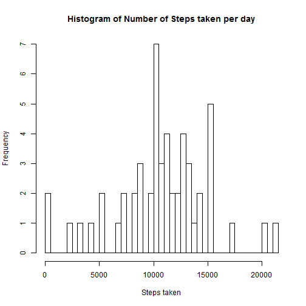
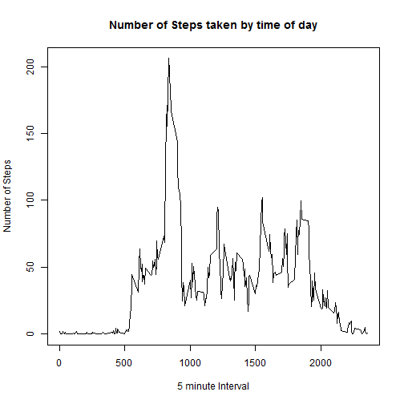
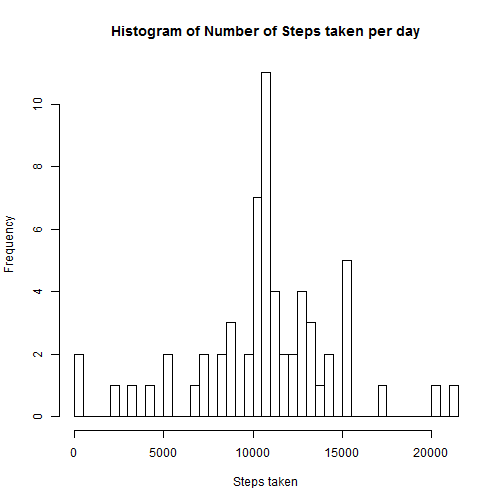
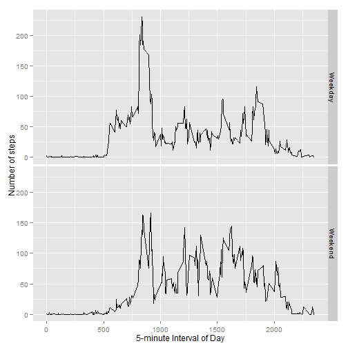

# Reproducible Research - Assignment 1

The objective of this assignment is to create a HTML report of the analysis, to help anyone who might be interested, in reproducing the research at his end.

This assignment makes use of data from a personal activity monitoring device. This device collects data at 5 minute intervals through out the day. The data consists of two months of data from an anonymous individual collected during the months of October and November, 2012 and include the number of steps taken in 5 minute intervals each day.

The analysis aims to load and pre-process the data, and then analyze it for understanding the average daily activity pattern. Subsequently, the analysis proceeds to imputing missing values (places where step count was not captured), and then repeats the average daily activity pattern analysis. Last, it analyzes the differences in activity patterns between weekdays and weekends.

## Loading and preprocessing the data
The code chunk below downloads and unzips the data in the work folder. For the first part of the analysis, the NAs are filtered out.


```r
# Download and unzip file
if (!file.exists("ReproResearch")) {
    dir.create("ReproResearch")
}
link <- "https://d396qusza40orc.cloudfront.net/repdata%2Fdata%2Factivity.zip"
destin <- "./ReproResearch/repdataactivity.zip"
downfile <- download.file(link, destfile = destin)
unzipped <- unzip(destin, exdir = "./ReproResearch")

# Read CSV file
readF <- read.csv("./ReproResearch/activity.csv")

# Remove rows with NA
readF2 <- na.omit(readF)
```

## Calculating the mean total number of steps taken per day
After removing the NAs from the data, a histogram is plotted to show the distribution of number of steps taken per day. Subsequently the mean and median values of total number of steps taken per day are calculated.


```r
# Sum the steps completed by date, and plot histogram
sumsteps <- aggregate(steps~date, data=readF2, sum)
hist(sumsteps$steps, breaks=50, main = "Histogram of Number of Steps taken per day"
     , xlab = "Steps taken")
```

 

```r
# Calculate Mean and Median total number of steps taken per day
avg <- mean(sumsteps$steps)
med <- median(sumsteps$steps)
paste("Mean of number of steps taken in a day =", avg)
```

```
## [1] "Mean of number of steps taken in a day = 10766.1886792453"
```

```r
paste("Median of number of steps taken in a day =", med)
```

```
## [1] "Median of number of steps taken in a day = 10765"
```

## Analyzing the average daily activity pattern
Next, a time series is plotted to depict the 5-minute interval (on x-axis) and the average number of steps taken averaged across all days (on y-axis). This is used to calculate which 5-minute interval on average across all the days in the dataset, contains the maximum number of steps.


```r
# Calculate avg steps at each 5 minute interval, plot trendline and find maximum
aves <- aggregate(steps ~ interval, data=readF2, mean)
plot(aves$interval, aves$steps, type="l", main="Number of Steps taken by time of day"
     , xlab = "5 minute Interval", ylab = "Number of Steps")
```

 

```r
maxsteps <- aves[which.max(aves$steps),]$interval
paste("Maximum steps are contained in", maxsteps,"interval")
```

```
## [1] "Maximum steps are contained in 835 interval"
```

## Imputing NAs with mean of steps taken during that time interval
Given that we had removed NAs, there is a chance that our results might have gotten skewed. In order to study if this actually happened, the analysis imputes values for NA, replacing NA with number of steps taken duting that time interval, averaged across all days.


```r
# count number of missing values
paste("Number of NAs is", sum(is.na(readF$steps)))
```

```
## [1] "Number of NAs is 2304"
```

```r
# Impute NAs present in Steps columns. Replace NA with average value for that time interval
replaceAverage <- function(steps, interval) {
    imputedRow <- NA
    if(!is.na(steps)) {
        imputedRow <- c(steps)
    } else {
        imputedRow <- aves[aves$interval == interval,]$steps
    }
    return(imputedRow)
}

imputedData <- readF
imputedData$steps <- mapply(replaceAverage, imputedData$steps, imputedData$interval)
```

This is followed by plotting a histogram to show the distribution of number of steps taken per day, and a calculation of the mean and median values of total number of steps taken per day.


```r
# Sum the steps completed by date, and plot histogram for the imputed data set
sumstepsimputed <- aggregate(steps~date, data=imputedData, sum)
hist(sumstepsimputed$steps, breaks=50, main = "Histogram of Number of Steps taken per day"
     , xlab = "Steps taken")
```

 

```r
# Calculate Mean and Median and reconcile with histogram
avgimputed <- mean(sumstepsimputed$steps)
medimputed <- median(sumstepsimputed$steps)
paste("Mean of number of steps taken in a day =", avgimputed)
```

```
## [1] "Mean of number of steps taken in a day = 10766.1886792453"
```

```r
paste("Median of number of steps taken in a day =", medimputed)
```

```
## [1] "Median of number of steps taken in a day = 10766.1886792453"
```

## Analyzing the differences in activity patterns between weekdays and weekends
Last, the R program analyzes the differences in activity patterns between weekdays and weekends. This is done by adding weekday and weekend as factor variable, and plotting 2 time series as a panel plot (one time series each for Weekday and Weekend) to depict the 5-minute interval (on x-axis) and the average number of steps taken averaged across all days (on y-axis).


```r
library(ggplot2)
# Add column to imputed data indicating weekday or weekend as factor variable
weekday_or_weekend <- function(dates) {
    day_name <- weekdays(as.Date(dates))
    weekday_weekend <- if(day_name %in% c("Saturday", "Sunday")) {
        return("Weekend")
    } else {
        return("Weekday")
    }
}

dayofweek <- sapply(imputedData$date, FUN = weekday_or_weekend)
imputedData$dayofweek <- dayofweek

# Find difference in pattern on weekday and weekend
aves_dayofweek <- aggregate(steps ~ interval + dayofweek, data=imputedData, mean)
ggplot(aves_dayofweek, aes(interval, steps)) + geom_line() + facet_grid(dayofweek ~ .) +
    xlab("5-minute Interval of Day") + ylab("Number of steps")
```

 
